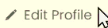

# Project 3: Spots

### Overview

- Intro
- Figma
- Images

**Intro**

This project is made so all the elements are displayed correctly on popular screen sizes. We recommend investing more time in completing this project, since it's more difficult than previous ones.

**Figma**

- [Link to the project on Figma](https://www.figma.com/file/BBNm2bC3lj8QQMHlnqRsga/Sprint-3-Project-%E2%80%94-Spots?type=design&node-id=2%3A60&mode=design&t=afgNFybdorZO6cQo-1)

**Images**

The way you'll do this at work is by exporting images directly from Figma — we recommend doing that to practice more. Don't forget to optimize them [here](https://tinypng.com/), so your project loads faster.

Good luck and have fun!

## Description

This project is to create a website where people can share their stories in form of pictures and explore others' stories.

- After all a picture is worth a thousand workds. -Unknown

## Functionalities

- Allows users to create profile (TBI)
- Allows users to add profile picture, name and description (about me!)
- Allows users to share pictures on the website (TBI)
- Allows users to access website on different sizes of screen (ie. Desktop, Tablet, and Mobile)\
- Allows users to like pictures on the website.

## Technologies and Techniques

- So far basic CSS and HTML has been utilized in making of this website.
- Flexbox
- Grids
- Compartmentalizing,
- Media queries
- And many more concepts has been combined to make website look similar to the given Figma design.

## GIFs of hover feature

## Project Link

-

## Project Pitch

-
